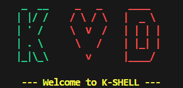

# k-shell 🐚


A custom Unix shell implementation written in C.
Designed to explore core Operating System concepts including process creation, memory management, and system calls.



## 🚀 Features

**Phase 1: The Foundation (Current)**
* **REPL Interface:** A robust Read-Eval-Print Loop.
* **Command Parsing:** Tokenizes user input (handling spaces and tabs).
* **Process Execution:** Uses `fork()`, `execvp()`, and `wait()` to run external programs (e.g., `ls`, `grep`, `git`).
* **Built-in Commands:** Custom implementations of core shell utilities.
* **Error Handling:** Safe handling of EOF (`Ctrl+D`) and invalid commands.
* **Visuals:** Colored output and custom ASCII art branding.

## 🛠️ Built-in Commands

| Command | Description |
| :--- | :--- |
| `cd <dir>` | Change the current working directory. |
| `help` | Display the user guide and available commands. |
| `exit` | Terminate the shell session safely. |
| `clear` | Clear the terminal screen and scrollback. |
| `pwd` | Print the current working directory. |
| `whoami` | Display the current username. |
| `type <cmd>` | Identify if a command is a built-in or external executable. |
| `echo <text>` | Print text to the standard output. |
| `env` | Print all environment variables. |

## ⚙️ Installation & Usage

### Prerequisites
* **OS:** Linux (Ubuntu/Fedora) or Windows (via WSL2).
* **Compiler:** GCC.
* **Build Tool:** Make.

### Building the Shell
1.  Clone the repository:
    ```bash
    git clone git@github.com:Kedrich/k-shell.git
    cd k-shell
    ```

2.  Compile using the Makefile:
    ```bash
    make
    ```

3.  Run the shell:
    ```bash
    ./k-shell
    ```

## 🧠 Learning Objectives
The primary goal of this project is to demystify Operating System internals by building them from scratch.
**Core Objectives:**
* **To understand System Calls:** specifically how `fork`, `exec`, and `wait` interact with the kernel.
* **To practice Low-Level String Parsing:** handling raw C strings without high-level abstractions.
* **To master Process Management:** managing the lifecycle of child processes and signals.
* **To explore Memory Management:** (Upcoming in Phase 2) transitioning from stack to heap allocation.

## 🗺️ Roadmap
- [x] **Phase 1:** Basic Execution & Built-ins (Completed)
- [ ] **Phase 2:** Dynamic Memory Management (Heap allocation)
- [ ] **Phase 3:** I/O Redirection (`>`, `<`) & Pipes (`|`)
- [ ] **Phase 4:** Command History & Configuration

---
*Created by Kedrich.*